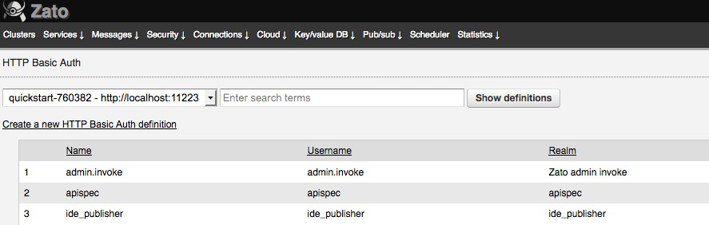
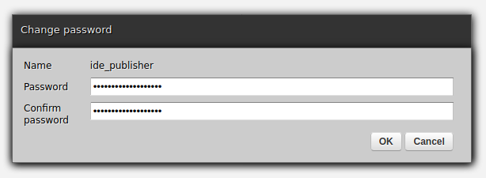
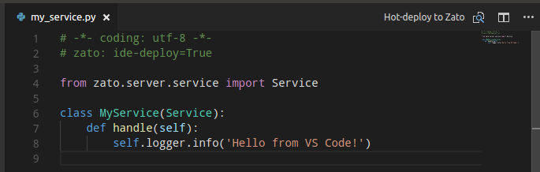

# Zato for Visual Studio Code

This is a Visual Studio Code extension that enables single keypress and single
click hot-deployment of the active Python source file to a Zato cluster
specified in your workspace or global configuration.

## Prerequisites

All Zato versions are supported. For Zato 3.0+, there are no prerequisites.

With Zato 2.0 or earlier, follow steps below:

* Deploy <a href="https://github.com/zatosource/zato-labs/blob/main/ide-deploy/ide_deploy.py">this service</a> to a Zato cluster

* Mount the newly deployed service on <a href="https://zato.io/docs/web-admin/channels/plain-http.html">an HTTP channel</a> with a URL path of /ide-upload

* Continue to Setup section below

## Setup

* Once you have installed the extension, visit the **Security -> HTTP Basic
  Auth** section of the administration UI for your cluster:

  

* Select the **Change password** option for the pre-installed **ide_publisher**
  account:

  

* Set the password to a strong one, and choose **OK**.

* Open **User Settings** in Visual Studio Code, and filter the file by using
  the string "zato".

* Update the `url` key to point to the base URL of either your one of your Zato
  cluster servers, or its load balancer address. For example,
  `http://zato:17010/ide-deploy`.

* Update the `password` to match the password you entered above.

* Open the Visual Studio command palette (Cmd-Shift-P or Ctrl-Shift-P) and
  search for "zato".

* Select the **Test Zato Connection** command. A message should appear
  indicating communication with the cluster was successful.

## Deployment

Make sure that each Python module with Zato services contains this marker at the top:

# zato: ide-deploy=True

This signals to the extension that this particular Python file contains services that can be
hot-deployed to clusters.

Next, while editing a Python source file, simply tap Ctrl-Shift-L (or Cmd-Shift-L on
Mac) to start deployment of the current file. The file's basename is used as
its module filename on the server.

The hot-deploy feature is additionally available from the command palette
(Ctrl-Shift-P) and as an editor toolbar option.

The source file is always assumed to be in UTF-8. This matches the expectation
that Zato modules are always written in UTF-8.

